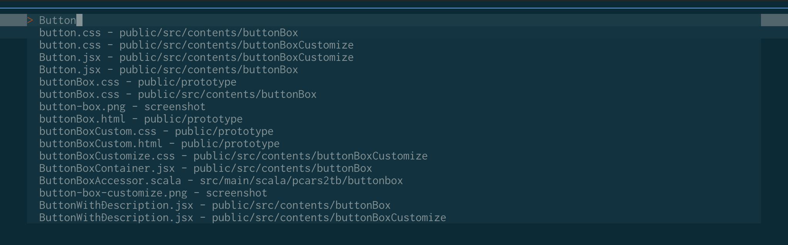

# denite-converter-basename_to_top
It is a converter to change the display of file name-directory name in denite.nvim

## USAGE
```vim
call denite#custom#source('file/rec', 'converters',
    \ ['converter/basename_to_top'])
```

## Screen shot

